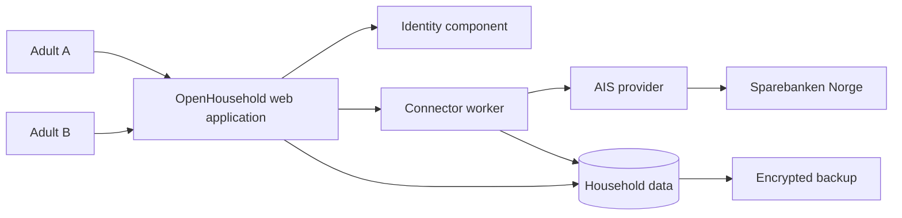

# Proposed architecture — tailored arc42

Status: proposed; [ADR-002](../decisions/ADR-002-architecture.md). The reuse trial
can replace this candidate without changing approved user requirements.

## 1. Introduction and goals

Correct financial observations, independent consent, understandable goal progress
and recoverable self-hosting take priority over broad feature coverage.
See [requirements](requirements.md) and [acceptance](acceptance.md).

## 2. Constraints

One household initially; weekly AIS only; separate adult identities; sensitive
data stays under the household's control. No product implementation is approved
by merely creating this repository. Actual/Firefly reuse is evaluated before
committing to a new financial core. No framework or runtime is selected here.

## 3. Context and scope

Users authorize with the bank/provider; OpenHousehold receives limited account
access. Provider and bank are external trust boundaries. Host administrator and
backup operator are trusted but fallible actors.

## 4. Solution strategy

Proposed fallback is a modular monolith with a separately permissioned connector
worker. Keep one deployable application codebase, a relational database, a mature
identity component and explicit adapters. Separate modules do not require separate
microservices. A connector process/service identity restricts credential access.
No event broker, Kubernetes, generic plugin marketplace or autonomous agent layer
is needed for this slice.

First test whether an existing application meets the requirements directly.
If integrating, pick one owner of imported financial facts and use a one-way
projection into household-specific calculations; avoid bidirectional synchronization
until conflict semantics are approved and tested.

## 5. Building blocks

| Module | Owns | Must not own |
| --- | --- | --- |
| Identity/household | Sessions, membership and authorization | Bank authentication secrets |
| Connections | Consent state, scheduling and credential handles | Goal arithmetic |
| Connector worker | Provider access, normalization and staging | Presentation or financial execution |
| Financial records | Canonical identity, exact money, revisions and provenance | Provider-specific business logic |
| Goals/observations | Funding revisions and deterministic calculations | Account credentials or external LLM calls |
| Presentation | Mobile/desktop views and accessible interactions | Authorization by client-only checks |
| Operations | Backup, migrations, metadata-only health and audit | Financial payload logging |

[Domain](domain.md) and [interfaces](interfaces.md) define the semantic contracts.

## 6. Runtime view

Connection: session -> bound consent state -> provider/bank -> validated callback
-> private account discovery -> explicit sharing -> shared view.

Refresh: due job -> consent check -> credential resolution -> paginated staging
-> identity/revision reconciliation -> atomic account publish -> authorized goal
recomputation -> deduplicated notices. A failed account retains its last complete
snapshot. The UI never waits for a live bank request to render the overview.

Withdrawal: revoke grant -> invalidate derived shared data -> bump authorization
revision -> recheck in-flight responses. Disconnect similarly fences the worker
before its next request. Restore keeps ingress/egress disabled until migrations,
integrity and deletion replay complete.

## 7. Deployment view

Candidate: Linux host, HTTPS reverse proxy, application, connector worker,
relational database and mounted encrypted credential store; encrypted backups go
to a separately protected destination. Private network access is the default
proposal; remote browser use still uses app authentication and HTTPS. Hosted
identity is optional and may carry identity metadata, never financial content.

PostgreSQL is the proposed baseline for transactional publication and concurrent
jobs; SQLite is a valid smaller alternative if locking, backup and isolation pass
the same scenarios. Reuse may determine storage instead. These are unapproved
choices in Q-06, not installed services. Runtime images and migrations will be
pinned after stack selection.

## 8. Crosscutting concepts

Authorization is evaluated before every financial read, including derived values.
Exact money, immutable provenance, idempotent ingestion and explicit uncertainty
apply across modules. Secrets are unavailable to analysis/UI service identities.
Threat and recovery behavior are specified in [threat model](threat-model.md) and
[operations](operations.md). A deployment cannot protect against a hostile root
operator while processing plaintext; encryption at rest addresses different risks.

## 9. Architectural decisions

[Decision records](../decisions/README.md) distinguish adopted repository process
from proposed product design. Reuse, authorization, canonical identity and
source-of-truth choices precede framework selection.

## 10. Quality requirements

Quality scenarios include retry/crash consistency (AC-006/007), access revocation
(AC-017), restore (AC-021), accessibility (AC-022), latency (AC-023) and provider
replacement (AC-024). The register is authoritative for thresholds.

## 11. Risks and technical debt

Primary risks: provider ineligibility for both owners; legacy-bank migration;
private-data leakage through totals; duplicate account identity; unrecoverable
keys; reuse mismatch; overly broad initial scope. Research and the question
register assign evidence gates rather than assuming these risks solved.
The [deferred list](../decisions/deferred.md) records triggers for later work.

## 12. Glossary

Use the shared [SRS glossary](../SPEC.md). One name per concept: connection is
provider authorization; account is canonical financial identity; sharing is
application permission. None is an interchangeable synonym for ownership.
